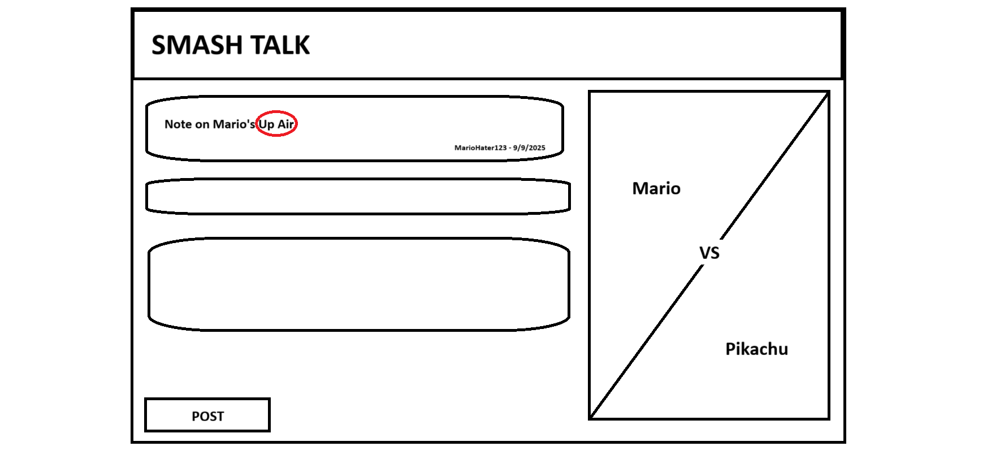

# Smash Talk

[My Notes](notes.md)

Smash Talk is a companion tool for competitive players of Super Smash Bros. Ultimate. The primary feature will be note taking. Users can select a character to take notes on. To be better from just a normal note taking app, Smash Talk will allow users to add tags to their notes for organization and shareability. Users can search through all the notes for a specific character matchup that have been made public by other users. 

> [!NOTE]
>  This is a template for your startup application. You must modify this `README.md` file for each phase of your development. You only need to fill in the section for each deliverable when that deliverable is submitted in Canvas. Without completing the section for a deliverable, the TA will not know what to look for when grading your submission. Feel free to add additional information to each deliverable description, but make sure you at least have the list of rubric items and a description of what you did for each item.

> [!NOTE]
>  If you are not familiar with Markdown then you should review the [documentation](https://docs.github.com/en/get-started/writing-on-github/getting-started-with-writing-and-formatting-on-github/basic-writing-and-formatting-syntax) before continuing.

## 🚀 Specification Deliverable

> [!NOTE]
>  Fill in this sections as the submission artifact for this deliverable. You can refer to this [example](https://github.com/webprogramming260/startup-example/blob/main/README.md) for inspiration.

For this deliverable I did the following. I checked the box `[x]` and added a description for things I completed.

- [x] Proper use of Markdown
- [x] A concise and compelling elevator pitch
- [x] Description of key features
- [x] Description of how you will use each technology
- [x] One or more rough sketches of your application. Images must be embedded in this file using Markdown image references.

### Elevator pitch

Smash players are some of the most dedicated competitive gamers out there. There is so much to learn about in the game, and players are always trying to keep track of their recently gained experience. SmashTalk will allow these players to take, post, and view notes made by others. Notes can be organized by character and move, making it easy for users to find exactly what they need. On top of that, community building features like sharing your main character, tournament results, and socials for potential requests to practice will have smash players always using SmashTalk as their smash note keeping companion.

### Design

The core design includes the note feed, a display showing which character page you are viewing, and text for each note (text content, upvotes, downvotes, poster, date and time).

This would be a profile page, which shows a few pieces of information (main character, discord link, win rate, and desired practice) and their recent posts.

### Key features

* posting notes that are organized by character
* logging in with a start.gg account (tournament website that keeps tournament data) to be able to see your performance against different characters
* upvoting / downvoting notes, so only the most relevant and community approved notes are shown first
* sharing your current online score (smash uses a score rather than ranking for online, so comparing scores is helpful for seeing how you place amongst all players)

### Technologies

I am going to use the required technologies in the following ways.

- **HTML** - The structure of my website. Text, images, buttons. Necessary for all pages (profile, character feeds).
- **CSS** - The styling of my website. I don't think I'll have any animations, just static styling. I need it to look professional so people will actually use it, since my website requires a userbase to be functional. I'll probably have to seed it with notes anyways.
- **React** - Dynamic front end stuff. This will handle stuff like the note feed on each character page. Also will be necessary for sorting and searching features.
- **Service** - I'll use the discord api do users can connect their discord account to their smash talk account. This will allow users to make it public, allowing message requests for practicing the character matchup. I might use the start.gg api if I have time, to add the ability to pull tournament results. I will use the data from the tournament results to display recent success with that character on the character page. 
- **DB/Login** - I'll have a database for storing the notes that are posted, and for storing account information. 
- **WebSocket** - I'll make the note feed (comments, upvotes, downvotes) update through a websocket, so you can see it update live.

## 🚀 AWS deliverable

For this deliverable I did the following. I checked the box `[x]` and added a description for things I completed.

- [x] **Server deployed and accessible with custom domain name** - [My server link](https://yourdomainnamehere.click).

## 🚀 HTML deliverable

For this deliverable I did the following. I checked the box `[x]` and added a description for things I completed.

- [x] **HTML pages** - index, feed, profile, character list pages are all structured
- [x] **Proper HTML element usage** - I used a header with a nav for my links between pages. I used a footer for my github link and name. I used body correctly. Same with main.
- [x] **Links** - My header contains links to all the pages.
- [x] **Text** - There isn't much text in my app yet, other than instructions. Most is user generated. Text can be found on the feed page.
- [x] **3rd party API placeholder** - The API will be on the feed page, where it displays the tournament data for that character.
- [x] **Images** - There's an image in the header, and images on the feed and profile pages.
- [x] **Login placeholder** - It can be found on the index page. The username will be displayed as the link to the profile page in the header.
- [x] **DB data placeholder** - Database data will be shown in the feed (Post Contents). Posts made by users are saved and displayed.
- [x] **WebSocket placeholder** - The posts on the feed have like buttons and like counters. These will update in real time using a websocket.

## 🚀 CSS deliverable

For this deliverable I did the following. I checked the box `[x]` and added a description for things I completed.

- [x] **Header, footer, and main content body** - Header and footer have colored text, special font, and flex displays.
- [x] **Navigation elements** - The navs in the header are flexible, and styled to sit on the right side of the header unless the screen is too narrow. They are then centered and placed in a column.
- [x] **Responsive to window resizing** - The header is responsive to window resizing by changing to a column of links when the screen is narrow, and the footer doubles in padding.
- [x] **Application elements** - The like buttons on the feed use bootstrap primary button styling (except they're red!). The feed is centered. 
- [ ] **Application text content** - I did not complete this part of the deliverable.
- [ ] **Application images** - I did not complete this part of the deliverable.

## 🚀 React part 1: Routing deliverable

For this deliverable I did the following. I checked the box `[x]` and added a description for things I completed.

- [ ] **Bundled using Vite** - I did not complete this part of the deliverable.
- [ ] **Components** - I did not complete this part of the deliverable.
- [ ] **Router** - I did not complete this part of the deliverable.

## 🚀 React part 2: Reactivity deliverable

For this deliverable I did the following. I checked the box `[x]` and added a description for things I completed.

- [ ] **All functionality implemented or mocked out** - I did not complete this part of the deliverable.
- [ ] **Hooks** - I did not complete this part of the deliverable.

## 🚀 Service deliverable

For this deliverable I did the following. I checked the box `[x]` and added a description for things I completed.

- [ ] **Node.js/Express HTTP service** - I did not complete this part of the deliverable.
- [ ] **Static middleware for frontend** - I did not complete this part of the deliverable.
- [ ] **Calls to third party endpoints** - I did not complete this part of the deliverable.
- [ ] **Backend service endpoints** - I did not complete this part of the deliverable.
- [ ] **Frontend calls service endpoints** - I did not complete this part of the deliverable.
- [ ] **Supports registration, login, logout, and restricted endpoint** - I did not complete this part of the deliverable.

## 🚀 DB deliverable

For this deliverable I did the following. I checked the box `[x]` and added a description for things I completed.

- [ ] **Stores data in MongoDB** - I did not complete this part of the deliverable.
- [ ] **Stores credentials in MongoDB** - I did not complete this part of the deliverable.

## 🚀 WebSocket deliverable

For this deliverable I did the following. I checked the box `[x]` and added a description for things I completed.

- [ ] **Backend listens for WebSocket connection** - I did not complete this part of the deliverable.
- [ ] **Frontend makes WebSocket connection** - I did not complete this part of the deliverable.
- [ ] **Data sent over WebSocket connection** - I did not complete this part of the deliverable.
- [ ] **WebSocket data displayed** - I did not complete this part of the deliverable.
- [ ] **Application is fully functional** - I did not complete this part of the deliverable.
